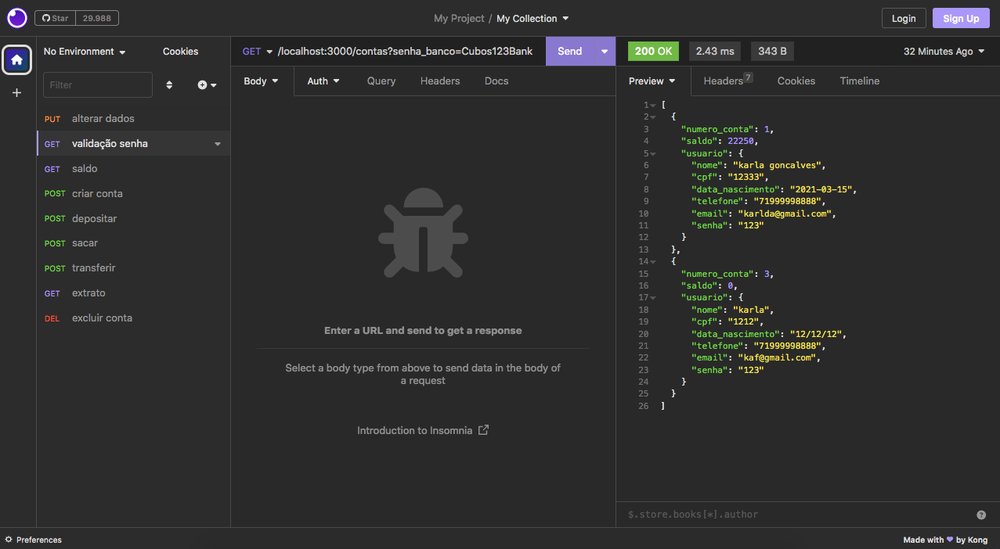

## API REST DE CONTA BANCÁRIA

    
    

---

💻 Sobre o projeto:

Desafio proposto no segundo módulo do curso de Desenvolvimento de Software com foco em Backend, oferecido pela Cubos Academy em parceria com o Ifood.

Trata-se de um projeto para uma API REST que simula operações bancárias básicas. Através desta API, é possível:

- Criar uma conta bancária;
- Listar todas as contas bancárias;
- Atualizar os dados do titular da conta bancária;
- Excluir uma conta bancária;
- Realizar depósitos em uma conta bancária;
- Efetuar saques de uma conta bancária;
- Transferir valores entre contas bancárias;
- Consultar o saldo de uma conta bancária;
- Emitir um extrato bancário.

---

⚙️ Tecnologias e Ferrementas Utilizadas:

- Node.js;
- Express;
- Date-fns;
- Nodemon;
- Insomnia;
- Git/Github;
- VSCode.

---

🛣️ Teste a API:

Para testar a API, você pode usar o Insomnia ou qualquer outra ferramenta de sua preferência.

Utilizando os seguintes Endpoints:

- GET /contas?senha_banco=Cubos123Bank - Listar todas as conta;
- POST /contas - Criar uma nova conta;
- PUT /contas/:numeroConta/usuario - Alterar dados de uma conta específica;
- DELETE /contas/:numeroConta - Excluir uma conta específica;
- POST /transacoes/depositar - Realizar depósito em uma conta específica;
- POST /transacoes/sacar - Efetuarr saque em uma conta específica;
- POST /transacoes/transferir - Transferir valores entre contas bancárias;
- GET /contas/saldo?numero_conta=1&senha=123 - Obter o saldo de uma conta específica;
- GET /contas/extrato?numero_conta=1&senha=123 - Obter o extrato bancário de uma conta específica.

---

💪 Contribuições:

Sinta - se à vontade para contribuir com este projeto!
Faça um fork e envie um Pull Request.

---

👩‍💻 Autor:

Karla Gonçalves

---

📝 Licença:

Desenvolvido por Karla Gonçalves.

🚀 Entre em Contato:

